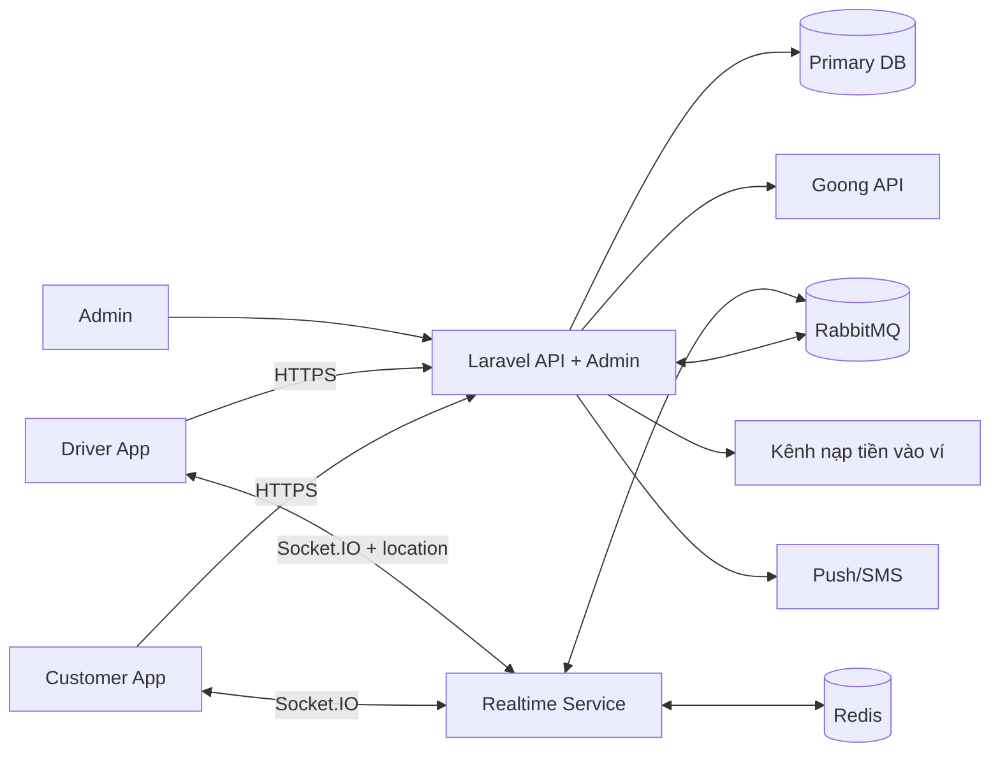
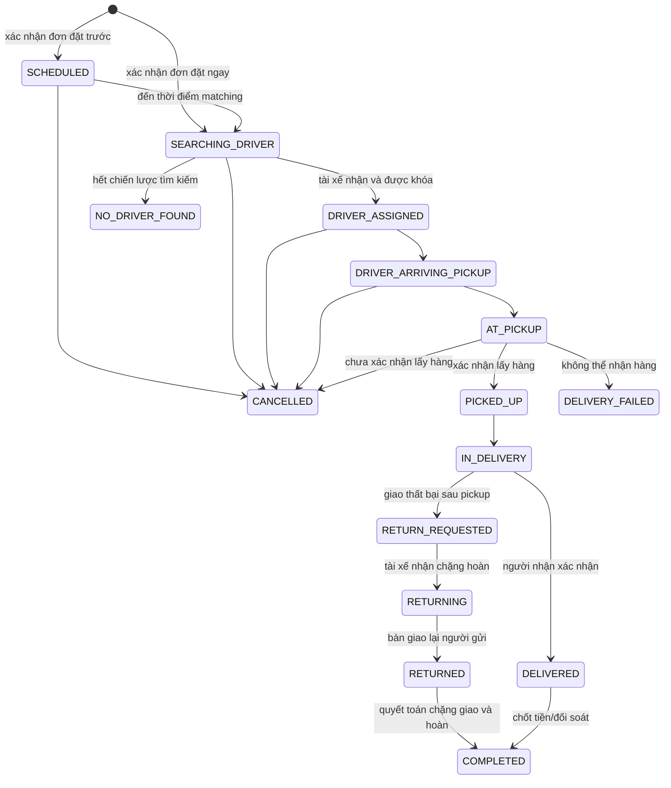
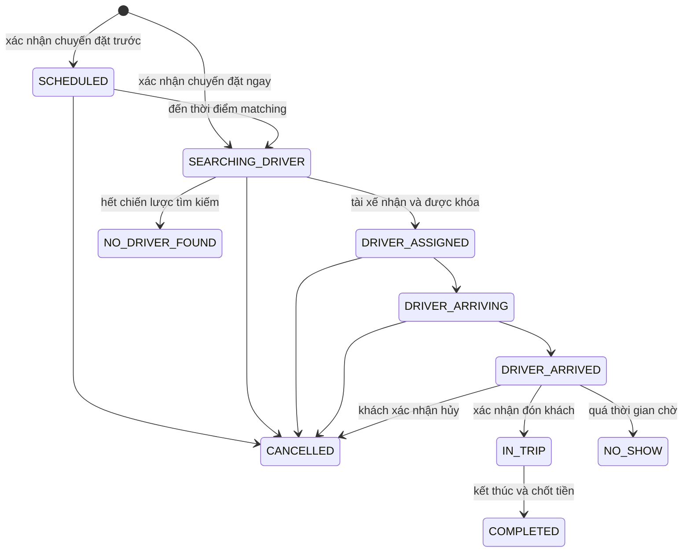

# Tổng quan dự án

## 1. Mục tiêu

Xây dựng nền tảng có hai dịch vụ trên cùng hệ thống:

- **Delivery**: khách hàng tạo yêu cầu giao hàng, hệ thống báo giá và ghép tài xế để lấy/giao hàng.
- **Drive**: khách hàng đặt chuyến chở người, hệ thống báo giá và ghép tài xế để đón/trả khách.

Hai dịch vụ dùng chung nền tảng API, định vị, ghép tài xế, thanh toán, thông báo, đánh giá và hỗ trợ, nhưng được cung cấp qua hai ứng dụng mobile riêng cho khách hàng và tài xế. Dữ liệu nghiệp vụ và state machine của Delivery/Drive phải tách biệt để tránh cập nhật nhầm trạng thái. Số điện thoại được xác minh bằng OTP ban đầu; các lần đăng nhập sau dùng số điện thoại + mật khẩu.

## 2. Actor

| Actor | Trách nhiệm |
|---|---|
| Khách hàng | Tạo yêu cầu, theo dõi, thanh toán, hủy, đánh giá, khiếu nại |
| Tài xế | Bật/tắt nhận cuốc, nhận yêu cầu, cập nhật tiến trình, thu tiền mặt hoặc nhận thanh toán sau hoàn tất |
| Admin/Điều phối | Duyệt tài xế, giám sát, gán lại, hủy cưỡng bức, xử lý sự cố/khiếu nại |
| Hệ thống ghép tài xế | Chọn ứng viên, phát offer, khóa người thắng, mở rộng bán kính |
| Goong API | Geocode, route, quãng đường và ETA |
| Kênh nạp tiền | Xác nhận giao dịch nạp tiền vào ví lạnh; không tham gia trực tiếp vào thanh toán đơn/chuyến |
| Dịch vụ thông báo | Push notification/SMS khi cần fallback |

## 3. Ranh giới thành phần mục tiêu

| Thành phần | Vai trò |
|---|---|
| Mobile khách hàng (Flutter) | Tạo/theo dõi đơn-chuyến, ví, voucher, chat và hỗ trợ |
| Mobile tài xế (Flutter) | Hồ sơ tài xế, online, nhận offer, thực hiện đơn-chuyến và ví thu nhập |
| `worker/` (Laravel) | API nghiệp vụ, authentication, dữ liệu giao dịch, admin/back-office, queue jobs |
| RabbitMQ integration trong `worker/` | Laravel publish/consume message nghiệp vụ bằng outbox/consumer idempotent |
| `service/` (Node.js) | Socket.IO gateway, ingest vị trí và trạng thái hiện diện; dùng Redis và nhận event qua RabbitMQ |
| Database chính | Nguồn dữ liệu chuẩn cho user, driver, booking/order, wallet ledger, voucher và audit |
| Redis | Presence, vị trí gần nhất, distributed lock, cache ngắn hạn |
| RabbitMQ | Event giữa Laravel và realtime service; retry tác vụ bất đồng bộ |

Nguyên tắc sở hữu dữ liệu: Redis và Socket.IO không phải nguồn dữ liệu chuẩn. Trạng thái cuối cùng của đơn/chuyến chỉ hợp lệ sau khi được Laravel ghi transaction thành công vào database.

## 4. Aggregate nghiệp vụ chính

- `User`: tài khoản và role.
- `CustomerProfile`: thông tin khách hàng.
- `DriverProfile`: trạng thái duyệt, trạng thái hoạt động.
- `Vehicle`: loại xe, biển số, giấy tờ.
- `VehicleType`: loại xe do admin quản lý, có `unique_key`, sức chứa/giới hạn và trạng thái.
- `ServiceType`: `DELIVERY` hoặc `DRIVE`, tham chiếu loại xe và cấu hình khoảng cách/giá tối thiểu.
- `Quote`: báo giá có thời hạn.
- `DeliveryOrder`: đơn giao hàng.
- `RideBooking`: chuyến chở khách.
- `DriverOffer`: lời mời nhận đơn/chuyến gửi đến một tài xế.
- `Assignment`: kết quả ghép duy nhất giữa yêu cầu và tài xế.
- `Wallet`: ví lạnh nội bộ của khách hàng/tài xế, gồm số dư khả dụng và trạng thái nhận đơn/rút tiền.
- `WalletTransaction`: sổ cái bất biến cho nạp tiền, thanh toán, thu nhập, phí nền tảng, rút tiền và hoàn tiền.
- `Voucher`, `VoucherRedemption`: điều kiện mã giảm giá và lần sử dụng/khôi phục lượt voucher.
- `DiscountTransaction`: giao dịch giảm giá riêng, liên kết voucher với order/booking và Payment nhưng không liên kết Wallet.
- `Payment`: phương thức thanh toán phần còn lại (`WALLET` hoặc `CASH`), breakdown giảm giá và trạng thái quyết toán cho khách/tài xế.
- `DriverLastLocation`: một snapshot vị trí cuối cùng của tài xế (`last_location`, `last_location_at`), được ghi đè khi có sample mới; không lưu lịch sử hành trình.
- `Rating`, `SupportTicket`, `StatusHistory`: đánh giá, hỗ trợ và lịch sử thay đổi.

## 5. State machine Delivery

`DRAFT` là dữ liệu đang nhập trên client; `QUOTED` thuộc vòng đời của `Quote`. Hai trạng thái này không nằm trong `DeliveryOrder`. Order chỉ được tạo sau khi khách xác nhận quote.

`COMPLETED`, `CANCELLED`, `NO_DRIVER_FOUND`, `DELIVERY_FAILED` là trạng thái kết thúc. Trường hợp giao thất bại sau pickup được chuyển qua `RETURN_REQUESTED -> RETURNING -> RETURNED` trên chính `DeliveryOrder`, kèm `list_type = RETURN`; không tạo order/ReturnTask mới.

## 6. State machine Drive

Tương tự Delivery, `DRAFT` nằm trên client và `QUOTED` là trạng thái của `Quote`; sau khi xác nhận quote, `RideBooking` bắt đầu ở `SEARCHING_DRIVER` hoặc `SCHEDULED` tùy thời điểm đặt.

Không cho phép hủy thông thường khi `IN_TRIP`; trường hợp phải dừng chuyến sớm dùng nghiệp vụ sự cố, lưu điểm kết thúc thực tế và tính lại cước theo chính sách.

## 7. Trạng thái tài xế

Hai chiều trạng thái cần tách riêng:

| Nhóm | Giá trị | Ý nghĩa |
|---|---|---|
| Duyệt hồ sơ | `PENDING_REVIEW`, `APPROVED`, `REJECTED`, `SUSPENDED` | Quyền được hoạt động trên nền tảng |
| Khả dụng | `OFFLINE`, `ONLINE`, `OFFERED`, `BUSY` | Khả năng nhận đơn/chuyến tại thời điểm hiện tại |

Chỉ tài xế `APPROVED + ONLINE`, có phương tiện đúng loại và vị trí còn mới mới được đưa vào tập ứng viên.

Tài xế có số dư ví nhỏ hơn 0 không được nhận offer mới; không áp dụng một giới hạn nợ âm khác. Việc trừ phí nền tảng chỉ xảy ra sau khi hoàn tất, không xảy ra khi tài xế nhận offer.

## 8. Nguyên tắc chuyển trạng thái

1. Server quyết định trạng thái; client chỉ gửi command.
2. Mỗi transition phải kiểm tra `current_status` trong cùng transaction.
3. Chỉ có một `Assignment` active cho một đơn/chuyến và một tài xế chỉ có một công việc active trong MVP.
4. Dùng optimistic locking (`version`) hoặc update có điều kiện để ngăn hai request cùng thắng.
5. Command tạo đơn, nhận cuốc, giữ/ghi sổ ví và xác nhận nạp tiền phải hỗ trợ idempotency.
6. Mọi transition ghi `StatusHistory` gồm actor, trạng thái cũ/mới, lý do, timestamp và request/correlation id.
7. Event chỉ publish sau khi transaction thành công; ưu tiên outbox pattern.

## 9. Yêu cầu phi chức năng tối thiểu

- Hiện dùng chat trong app và gọi trực tiếp qua số điện thoại. Số điện thoại chỉ hiển thị cho hai bên trong phạm vi đơn/chuyến liên quan và phải có audit truy cập phù hợp.
- OTP chỉ dùng xác minh số điện thoại, không dùng cho các mốc lấy/giao hàng hoặc bắt đầu chuyến; OTP không xuất hiện trong log và phải giới hạn số lần thử.
- Vị trí là dữ liệu nhạy cảm; chỉ actor liên quan và admin được quyền truy cập.
- Chỉ lưu vị trí cuối cùng của tài xế; sample realtime cũ hết TTL/được ghi đè và không tạo bảng lịch sử hành trình.
- Callback/webhook từ kênh nạp tiền phải xác minh chữ ký và chống replay.
- “Ví lạnh” trong tài liệu là ví số dư nội bộ của hệ thống, không mang nghĩa ví crypto ngoại tuyến.
- `voucher_discount` chỉ giảm số tiền khách phải trả. Voucher không làm giảm thu nhập gộp của tài xế; phần được tài trợ được ghi vào `voucher_payment_amount` trong khoản thanh toán của tài xế, không tự động cộng vào ví.
- Không trừ tiền hoặc chiết khấu từ tài xế khi tài xế nhận offer. Mọi thu nhập, phí nền tảng hoặc điều chỉnh chỉ được ghi sổ sau khi dịch vụ hoàn tất.
- API ghi dữ liệu phải có rate limit và audit phù hợp.
- Thời gian trên server lưu UTC; client hiển thị theo múi giờ người dùng.
- Tiền tệ là VND và số tiền dùng kiểu `float` theo quyết định sản phẩm. Server phải làm tròn về đơn vị VND tại boundary và dùng tolerance khi đối chiếu, không so sánh float bằng phép bằng tuyệt đối.
- Ngôn ngữ/múi giờ hiện tại là tiếng Việt và `Asia/Ho_Chi_Minh`.
- Không đặt mục tiêu RTO/RPO hoặc tải business cho baseline đồ án; ưu tiên tính đúng của flow và khả năng chạy end-to-end.
