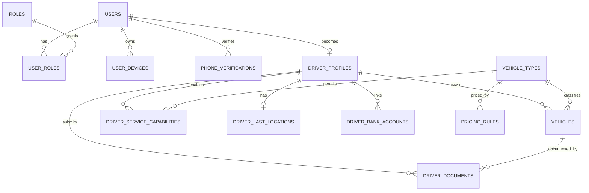
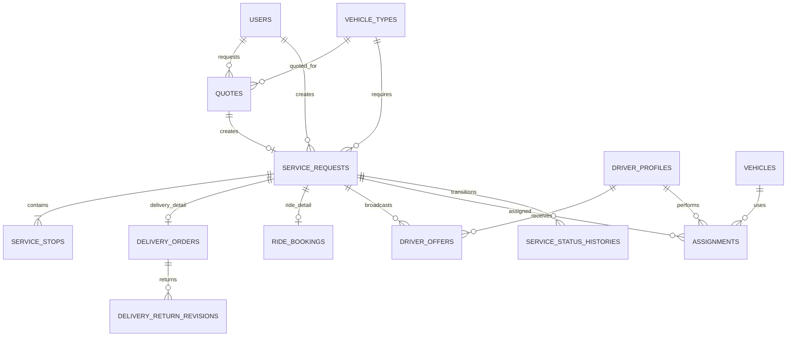
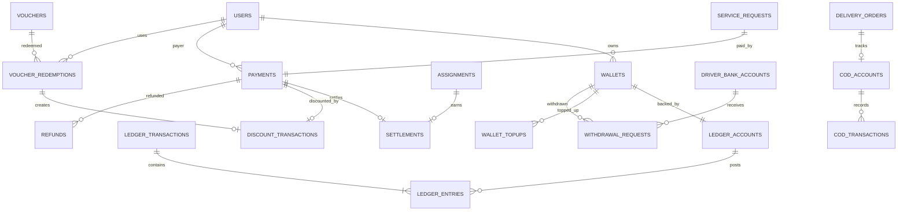
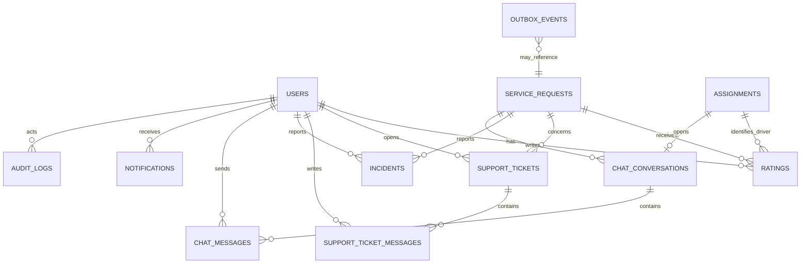

# ERD tổng thể

ERD được tách theo domain để dễ đọc. Các bảng framework của Laravel/Sanctum/queue không xuất hiện trong sơ đồ.

## Identity, driver và catalog

## Booking, Delivery và Drive

Mỗi `SERVICE_REQUESTS` phải có đúng một detail table theo `service_type`: `DELIVERY_ORDERS` hoặc `RIDE_BOOKINGS`. Mỗi request có đúng hai stop: `PICKUP` và `DROPOFF`.

## Finance

`DISCOUNT_TRANSACTIONS` không tạo ledger entry và không liên kết trực tiếp với wallet. Chỉ payment bằng `WALLET`, phí nền tảng, top-up, withdrawal, refund và adjustment mới ghi ledger.

## Support, realtime và integration

Outbox và audit dùng `aggregate_type/reference_type + id` vì chúng tham chiếu nhiều domain. Đây là polymorphic reference có validation ở application layer, không phải foreign key tổng quát.

## Cardinality bắt buộc

| Quan hệ | Quy tắc |
|---|---|
| User - DriverProfile | Một user có tối đa một hồ sơ tài xế |
| Driver - active assignment | Tối đa một assignment `ACTIVE` |
| ServiceRequest - active assignment | Tối đa một assignment `ACTIVE` |
| ServiceRequest - Payment | Đúng một payment sau khi request được tạo |
| ServiceRequest - stops | Đúng một `PICKUP` và một `DROPOFF` |
| Payment - Settlement | Tối đa một settlement hiện hành |
| Payment - DiscountTransaction | Tối đa một voucher discount trong MVP |
| User - Wallet | Tối đa một wallet cho mỗi currency |
| Driver - LastLocation | Tối đa một snapshot, update/overwrite |
| DeliveryOrder - CodAccount | Tối đa một, chỉ khi `is_cod = true` |
| Assignment - ChatConversation | Tối đa một; reassign tạo conversation mới |
