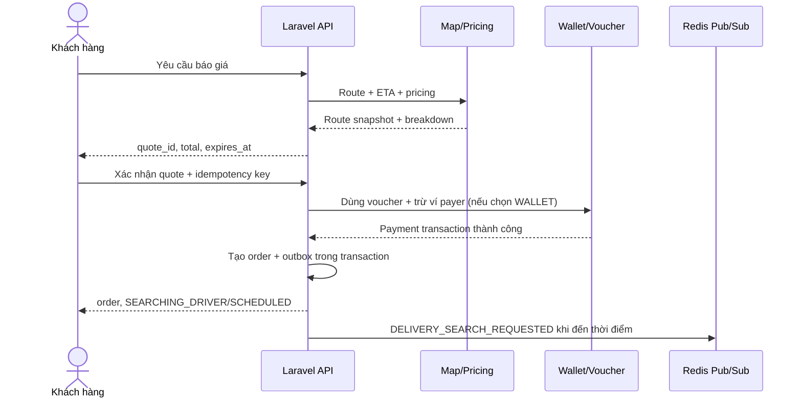

# Flow 03 - Delivery: Báo giá và tạo đơn

## Mục tiêu

Khách hàng nhập thông tin giao hàng, nhận báo giá có thời hạn và xác nhận tạo đơn Delivery để bắt đầu tìm tài xế.

## Tiền điều kiện

- Khách hàng đã đăng nhập và tài khoản `ACTIVE`.
- Điểm lấy/giao nằm trong vùng phục vụ.
- Nếu chọn ví lạnh, số dư khả dụng phải đủ để trừ `customer_payable` ngay khi tạo đơn.

## Dữ liệu đầu vào

- Điểm lấy: tọa độ chuẩn hóa, địa chỉ hiển thị, ghi chú, người gửi và số liên hệ.
- Điểm giao: tọa độ chuẩn hóa, địa chỉ hiển thị, ghi chú, người nhận và số liên hệ.
- Hàng hóa: loại hàng, mô tả, khối lượng/kích thước, giá trị khai báo, ảnh tùy chọn.
- COD tùy chọn: số tiền cần thu từ người nhận; đây là tiền hàng, tách khỏi phí vận chuyển.
- Loại phương tiện/dịch vụ.
- Người trả phí vận chuyển: `ORDERER` hoặc `RECIPIENT`.
- Phương thức thanh toán phần còn lại: `WALLET` hoặc `CASH`; server phải kiểm tra phương thức phù hợp với người trả phí.
- Voucher/mã giảm giá tùy chọn.
- Thời điểm thực hiện: đặt ngay hoặc `scheduled_at` cho đơn đặt trước.

## Luồng A - Lấy báo giá

1. Khách chọn Delivery và nhập điểm lấy/điểm giao.
2. API chuẩn hóa địa chỉ, kiểm tra vùng phục vụ và yêu cầu route từ Goong API.
3. Khách nhập thông tin hàng hóa và chọn loại phương tiện.
4. Server kiểm tra giới hạn hàng cấm, khối lượng/kích thước và năng lực phương tiện.
5. Pricing engine áp dụng giá cơ sở đến 3 km theo `vehicle_type.unique_key`; phần vượt 3 km tính theo `price_per_extra_km` của loại xe.
6. Server tính `gross_fare`, các thành phần phí, `voucher_discount` và `customer_payable = gross_fare - voucher_discount` bằng VND, rồi kiểm tra điều kiện voucher nhưng chưa đánh dấu đã dùng.
7. Server lưu `Quote` bất biến với `expires_at`, route snapshot, pricing breakdown và trả về client.

## Luồng B - Xác nhận tạo đơn

1. Khách kiểm tra địa chỉ, người liên hệ, hàng hóa, giá, voucher, người trả phí và chọn `WALLET` hoặc `CASH`.
2. Client gửi `quote_id` và idempotency key.
3. Server khóa/đọc quote và kiểm tra quote thuộc user, chưa dùng, chưa hết hạn.
4. Nếu có voucher, server tạo `VoucherRedemption` ở `USED` và một `DiscountTransaction` ngay khi tạo đơn. Nếu chọn `WALLET`, server trừ ngay `customer_payable` từ ví của payer bằng bút toán `CUSTOMER_PAYMENT`; nếu chọn `CASH`, không trừ tiền.
5. Trong một transaction, server:
   - Tạo `DeliveryOrder` từ snapshot của quote.
   - Đặt trạng thái khởi tạo là `SEARCHING_DRIVER` cho đơn ngay hoặc `SCHEDULED` cho đơn đặt trước.
   - Đánh dấu quote đã dùng.
   - Lưu `payer_type`, payment method bất biến, wallet transaction và discount transaction liên quan.
   - Ghi status history và outbox event.
6. Server trả mã đơn, trạng thái và thời gian thực hiện dự kiến.
7. Với đơn ngay, phát `DELIVERY_SEARCH_REQUESTED`. Với đơn đặt trước, scheduler phát event khi đến thời điểm matching được cấu hình.

## Sequence chính

## Nhánh lỗi

| Tình huống | Kết quả |
|---|---|
| Không geocode được địa chỉ | Yêu cầu khách chọn lại pin/địa chỉ |
| Ngoài vùng phục vụ | Không tạo quote; trả lý do rõ ràng |
| Hàng vượt giới hạn/hàng cấm | Từ chối loại dịch vụ tương ứng |
| COD vượt 8.000.000 VND hoặc hạn mức tài xế khả dụng | Không cho xác nhận/ghép tài xế không phù hợp; yêu cầu giảm COD hoặc chọn phương án khác |
| Quote hết hạn | Trả `QUOTE_EXPIRED`; client yêu cầu báo giá mới |
| Giá/route thay đổi | Tạo quote mới, không sửa quote cũ |
| Voucher không hợp lệ/hết lượt | Yêu cầu bỏ hoặc chọn voucher khác; không tạo order |
| Ví không đủ số dư khả dụng | Yêu cầu nạp thêm hoặc đổi sang `CASH`; không tạo order |
| Request xác nhận bị gửi lại | Trả đúng order đã tạo bằng idempotency key |

## Sự kiện

- `DELIVERY_QUOTE_CREATED`
- `DELIVERY_ORDER_CREATED`
- `DELIVERY_SEARCH_REQUESTED`
- `VOUCHER_USED`
- `CUSTOMER_WALLET_DEBITED`

## Tiêu chí nghiệm thu

- Tổng tiền hiển thị bằng tổng pricing breakdown, dùng kiểu `float` và làm tròn về đơn vị VND tại boundary.
- Rule giá là dữ liệu cấu hình: xe máy mặc định 18.000 VND đến 3 km và 5.000 VND/km vượt ngưỡng; ô tô có giá cơ sở 28.000/32.000 VND tùy loại và ví dụ 10.000 VND/km vượt ngưỡng. Không hard-code trong client.
- Order lưu snapshot địa chỉ/route/giá; thay đổi cấu hình sau đó không làm đổi order cũ.
- Mỗi đơn chỉ có một điểm lấy và một điểm giao.
- `cod_amount` tách khỏi `gross_fare/customer_payable` và không được tính là thu nhập tài xế.
- Với ứng COD, tài xế chỉ nhận offer khi hạn mức COD cấu hình lớn hơn hoặc bằng `cod_amount`.
- Quote hết hạn hoặc đã dùng không tạo thêm order.
- Hai request cùng idempotency key chỉ tạo một order, một voucher redemption/discount transaction và một bút toán trừ ví.
- Đơn dùng `WALLET` không được tạo nếu chưa trừ thành công `customer_payable`.
- Đơn dùng `CASH` không trừ ví khách hoặc ví tài xế khi tạo/nhận đơn.
