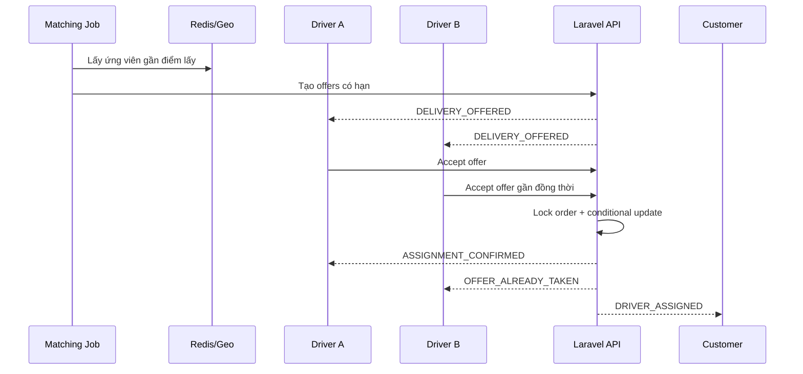

# Flow 04 - Delivery: Ghép tài xế

## Mục tiêu

Tìm một tài xế hợp lệ cho đơn Delivery trong thời gian giới hạn, bảo đảm chỉ một tài xế được assign dù nhiều người cùng nhận offer.

## Tiền điều kiện

- Đơn ở `SEARCHING_DRIVER`; đơn đặt trước chỉ vào trạng thái này khi scheduler kích hoạt matching.
- Nếu dùng `WALLET`, tiền của payer đã được trừ khi tạo đơn; nếu có voucher, lượt sử dụng đã được ghi nhận `USED`.
- Điểm lấy, loại phương tiện và yêu cầu hàng hóa đã được xác định.

## Tập ứng viên

Tài xế phải thỏa tất cả điều kiện:

- Hồ sơ `APPROVED`, availability `ONLINE`.
- Có capability `DELIVERY` và phương tiện phù hợp.
- Không có assignment active.
- Số dư ví tài xế lớn hơn hoặc bằng 0.
- Vị trí gần nhất không quá cũ và nằm trong bán kính hiện tại.
- Không bị giới hạn bởi vùng, loại hàng hoặc rule an toàn.
- Với đơn ứng COD, hạn mức COD tài xế cấu hình phải lớn hơn hoặc bằng `cod_amount` và không vượt hạn mức admin.

Ứng viên được xếp hạng theo ETA đến điểm lấy, khoảng cách, ưu tiên tỷ lệ nhận cao/tỷ lệ hủy thấp, fairness và các rule vận hành. Hiện không tự động suspension theo các tỷ lệ này và không dùng rating như tiêu chí duy nhất.

## Luồng chính

1. Matching job nhận `DELIVERY_SEARCH_REQUESTED` với `order_id` và `search_attempt`.
2. Job kiểm tra order vẫn ở `SEARCHING_DRIVER`; event cũ được bỏ qua an toàn.
3. Hệ thống lấy danh sách ứng viên từ Redis/geospatial index rồi lọc lại bằng dữ liệu chuẩn.
4. Hệ thống tạo `DriverOffer` có `expires_at` cho một nhóm nhỏ ứng viên và phát realtime/push.
5. Tài xế xem điểm lấy, điểm giao tương đối, quãng đường, thu nhập dự kiến, phương thức thanh toán, loại hàng/COD và thời gian phản hồi.
6. Tài xế bấm nhận; client gửi `offer_id` kèm idempotency key.
7. Server trong transaction/lock:
   - Kiểm tra offer còn hiệu lực và thuộc tài xế.
   - Kiểm tra order còn `SEARCHING_DRIVER`.
   - Kiểm tra tài xế vẫn `ONLINE` và chưa có assignment active.
   - Tạo `Assignment` active duy nhất.
   - Chuyển order sang `DRIVER_ASSIGNED` và tài xế sang `BUSY`.
   - Expire các offer còn lại và ghi outbox event.
8. Tài xế thắng nhận quyền chat in-app và số điện thoại trực tiếp trong phạm vi đơn; khách nhận hồ sơ tài xế, xe và ETA.
9. Tài xế bắt đầu di chuyển; order chuyển `DRIVER_ASSIGNED -> DRIVER_ARRIVING_PICKUP`.

## Mở rộng tìm kiếm

Mỗi vòng tìm kiếm có cấu hình riêng, ví dụ tăng bán kính hoặc số ứng viên. Khi một vòng hết offer mà chưa có assignment:

1. Kiểm tra order còn được phép tìm.
2. Tăng `search_attempt` và lên lịch vòng tiếp theo.
3. Thông báo tiến độ cho khách nếu thời gian chờ kéo dài.
4. Khi hết số vòng/thời gian tối đa, chuyển `NO_DRIVER_FOUND`.
5. Hoàn tiền về ví payer bằng bút toán đảo; voucher được khôi phục lượt nếu còn trong chính sách/giới hạn hoàn của campaign, rồi thông báo khách thử lại/chọn loại xe khác.

## Nhánh lỗi

| Tình huống | Xử lý |
|---|---|
| Tài xế từ chối | `DriverOffer -> DECLINED`; không ảnh hưởng offer khác |
| Offer hết hạn | Trả `OFFER_EXPIRED`; tài xế về `ONLINE` nếu đủ điều kiện |
| Offer đã có người nhận | Trả `OFFER_ALREADY_TAKEN`; không tạo assignment thứ hai |
| Tài xế mất kết nối sau assign | Chờ grace period, sau đó hủy assignment/reassign theo chính sách |
| Khách hủy trong lúc tìm | Chuyển order `CANCELLED`, expire toàn bộ offer và dừng job |
| Không có tài xế | Mở rộng tìm kiếm; hết chiến lược thì `NO_DRIVER_FOUND` |

## Sự kiện

- `DELIVERY_OFFERED`
- `DELIVERY_OFFER_ACCEPTED`
- `DELIVERY_OFFER_EXPIRED`
- `DELIVERY_DRIVER_ASSIGNED`
- `DELIVERY_NO_DRIVER_FOUND`
- `DELIVERY_DRIVER_REASSIGN_REQUESTED`

## Tiêu chí nghiệm thu

- Nhiều accept đồng thời chỉ tạo đúng một assignment active.
- Job/event lặp không tạo offer hoặc assignment sai trạng thái.
- Tài xế không phù hợp hoặc vị trí cũ không nhận offer.
- Order bị hủy không thể được assign bởi offer đến muộn.
- Hết thời gian tìm kiếm hoàn đúng khoản ví đã trừ, xử lý khôi phục voucher theo campaign và giải phóng availability liên quan.
