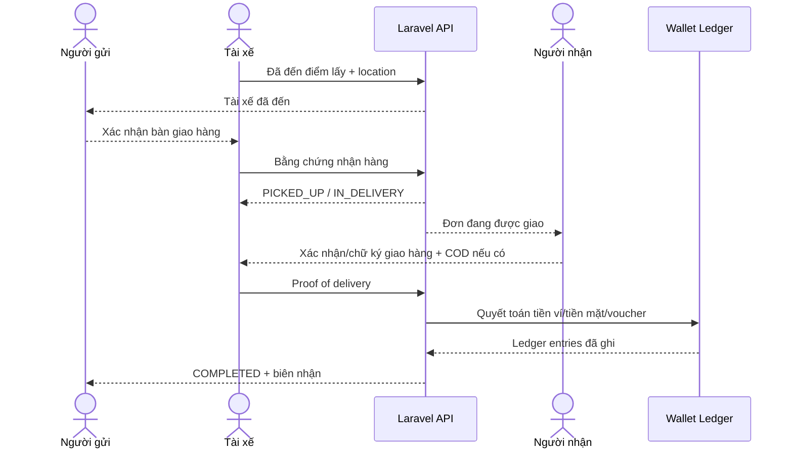

# Flow 05 - Delivery: Lấy và giao hàng

## Mục tiêu

Kiểm soát toàn bộ tiến trình sau khi ghép tài xế: đến điểm lấy, xác minh kiện hàng, vận chuyển, giao cho đúng người nhận và chốt đơn.

## Tiền điều kiện

- Có assignment active giữa đơn và tài xế.
- Tài xế dùng đúng phương tiện đã assign.
- Thiết bị tài xế đang gửi vị trí và có quyền thao tác trên đơn.

## Luồng A - Đến điểm lấy

1. Tài xế di chuyển đến điểm lấy ở `DRIVER_ARRIVING_PICKUP`.
2. Khách nhận ETA/vị trí qua realtime.
3. Khi trong geofence hợp lệ, tài xế bấm **Đã đến điểm lấy**.
4. Server kiểm tra assignment, trạng thái và vị trí; chuyển sang `AT_PICKUP`.
5. Hệ thống bắt đầu bộ đếm thời gian chờ và thông báo người gửi.

## Luồng B - Nhận hàng

1. Tài xế đối chiếu người gửi, mô tả, khối lượng/kích thước và tình trạng kiện hàng.
2. Nếu thông tin sai hoặc hàng không an toàn, tài xế chọn lý do từ chối nhận và tải bằng chứng khi cần.
3. Với đơn ứng COD, server kiểm tra `cod_amount` không vượt hạn mức tài xế đã cấu hình và hạn mức admin, hiện tối đa 8.000.000 VND.
4. Tài xế ứng `cod_amount` cho người gửi và ghi nhận xác nhận đã ứng trên COD ledger.
5. Người gửi xác nhận bàn giao trong ứng dụng; nếu người gửi không dùng app tại điểm lấy, tài xế ghi nhận bằng chứng theo chính sách.
6. Tài xế chụp ảnh/ghi nhận bằng chứng kiện hàng khi cấu hình yêu cầu.
7. Server kiểm tra xác nhận/bằng chứng, chuyển `AT_PICKUP -> PICKED_UP`.
8. Sau khi tạo route giao và bắt đầu di chuyển, chuyển `PICKED_UP -> IN_DELIVERY`.
9. Từ thời điểm `PICKED_UP`, đơn không thể hủy theo flow thông thường.

## Luồng C - Giao hàng

1. Tài xế đến điểm giao; client xác nhận geofence hoặc ghi rõ lý do ngoài geofence.
2. Hệ thống thông báo người nhận và bắt đầu thời gian chờ.
3. Người nhận xác nhận nhận hàng bằng chữ ký/xác nhận trên ứng dụng; tài xế bổ sung ảnh proof of delivery khi chính sách yêu cầu.
4. Nếu đơn có COD, tài xế thu lại `cod_amount` đã ứng từ người nhận và xác nhận số thực thu riêng với phí vận chuyển.
5. Server kiểm tra bằng chứng, chuyển `IN_DELIVERY -> DELIVERED`.
6. Server chốt `gross_fare`, `voucher_discount` và `customer_payable` theo snapshot/chính sách; không thu thêm khách khi có chênh lệch giá cuối.
7. Nếu dùng `CASH`, tài xế thu `customer_payable` từ payer (`ORDERER` hoặc `RECIPIENT`) và xác nhận đã thu trong command hoàn thành. Nếu dùng `WALLET`, hệ thống đối chiếu bút toán `CUSTOMER_PAYMENT` đã trừ khi tạo đơn và không trừ payer lần hai.
8. Hệ thống đọc discount transaction đã tạo khi đặt đơn và lập khoản thanh toán cho tài xế. Tiền mặt đã thu được ghi là `cash_collected`; phần thực trả qua ví ghi vào `wallet_payment_amount`; phần voucher tài trợ ghi vào `voucher_payment_amount`, không cộng vào ví tài xế.
9. Hệ thống tính tỷ lệ tài xế theo snapshot, hiện mặc định 88%. Với `CASH`, tài xế giữ toàn bộ tiền mặt và `platform_fee_debited` bị trừ khỏi ví sau hoàn tất; với `WALLET`, các bút toán ví tạo hiệu ứng ròng theo settlement.
10. Khi các bút toán idempotent được ghi nhận hợp lệ, chuyển `DELIVERED -> COMPLETED`.
11. Hệ thống giải phóng tài xế về `ONLINE` nếu tài xế vẫn bật nhận cuốc; phát biên nhận và mở flow đánh giá.

## Bằng chứng và bảo mật

- Không dùng OTP cho lấy/giao hàng; OTP chỉ dùng xác minh số điện thoại tài khoản.
- Ảnh phải lưu timestamp, actor và metadata cần thiết; URL truy cập có thời hạn.
- Chỉ yêu cầu chữ ký/ảnh khi chính sách dịch vụ cần; tránh thu thập dữ liệu quá mức.
- Tọa độ không khớp geofence không tự động chặn trong mọi trường hợp, nhưng bắt buộc reason và audit.

## Nhánh lỗi

| Tình huống | Xử lý |
|---|---|
| Không liên hệ được người gửi | Chờ đủ thời gian, gọi hỗ trợ, có thể `DELIVERY_FAILED` trước pickup |
| Hàng khác khai báo/hàng cấm | Không nhận; lưu reason/evidence; chuyển site/chat hỗ trợ khi cần |
| Không có xác nhận bàn giao | Yêu cầu bằng chứng thay thế và chuyển hỗ trợ thủ công theo rule |
| Không liên hệ được người nhận | Chờ đủ thời gian, thử kênh liên hệ; tạo quy trình giao lại/hoàn hàng |
| Ghi sổ ví thất bại sau giao | Giữ `DELIVERED`, retry quyết toán idempotent; không yêu cầu giao lại hàng |
| Khách không trả đủ tiền mặt | Tài xế báo cáo; support xác minh và hệ thống bù nếu đủ điều kiện; khách vi phạm đã xác minh bị khóa vĩnh viễn |
| Người nhận không trả đủ COD | Không gộp với phí vận chuyển; lưu số thực thu, báo support và chuyển chính order sang flow hoàn hàng khi được xác nhận |
| Mất mạng | Client lưu command cục bộ với idempotency key; đồng bộ lại khi có mạng |

## Sự kiện

- `DELIVERY_DRIVER_AT_PICKUP`
- `DELIVERY_PICKED_UP`
- `DELIVERY_IN_TRANSIT`
- `DELIVERY_DELIVERED`
- `DELIVERY_COMPLETED`
- `DELIVERY_FAILED`
- `DELIVERY_RETURN_REQUESTED`
- `DRIVER_EARNING_SETTLED`

## Tiêu chí nghiệm thu

- Chỉ tài xế được assign mới cập nhật tiến trình.
- Không thể xác nhận giao trước khi xác nhận lấy hàng.
- Command gửi lặp không tạo nhiều status history, wallet transaction hoặc khoản thu tiền mặt.
- Sau pickup, mọi ngoại lệ đều giữ audit về việc hàng đang do ai kiểm soát.
- `COMPLETED` có đủ payment/ledger record và proof theo cấu hình dịch vụ.
- Nhận đơn không làm giảm số dư tài xế; thu nhập chỉ được quyết toán sau khi giao hoàn tất.
- `voucher_payment_amount` làm tăng khoản thanh toán của tài xế nhưng không tạo bút toán ghi có ví.
- Với `CASH`, chỉ command hoàn thành idempotent của tài xế mới xác nhận `cash_collected`.
- COD không phải thu nhập tài xế; khoản thu tại điểm giao dùng để thu hồi số tiền tài xế đã ứng cho người gửi tại điểm lấy.
- Với ứng COD, COD ledger phải đối chiếu tiền tài xế đã ứng tại điểm lấy và tiền thu lại tại điểm giao.
