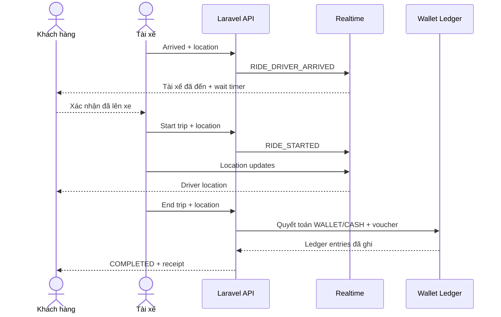

# Flow 08 - Drive: Đón khách và thực hiện chuyến

## Mục tiêu

Đưa tài xế đến đúng điểm đón, xác minh đúng khách, theo dõi chuyến đi và kết thúc với giá/biên nhận chính xác.

## Tiền điều kiện

- Booking có assignment active và ở `DRIVER_ASSIGNED` hoặc `DRIVER_ARRIVING`.
- Tài xế/phương tiện đang hoạt động đúng với assignment.
- Hai phía có kênh cập nhật trạng thái; tài xế gửi vị trí mỗi 1,5 giây.

## Luồng A - Đến đón khách

1. Tài xế đi đến pin đón; khách xem vị trí và ETA realtime.
2. Khi vào geofence, tài xế bấm **Đã đến**.
3. Server kiểm tra vị trí, assignment và trạng thái rồi chuyển `DRIVER_ARRIVING -> DRIVER_ARRIVED`.
4. Hệ thống thông báo khách và hiển thị thời gian tài xế đã chờ. Phiên bản hiện tại không tự động tính phí chờ.
5. Hai phía nhận diện nhau bằng hồ sơ tài xế, thông tin phương tiện và xác nhận trên ứng dụng; không coi biển số là yếu tố duy nhất.

## Luồng B - Bắt đầu chuyến

1. Khách xác nhận đã lên xe trên ứng dụng hoặc tài xế ghi nhận xác nhận theo rule khi khách không thao tác được.
2. Tài xế gửi command bắt đầu chuyến với vị trí.
3. Server kiểm tra xác nhận, geofence/reason ngoại lệ và booking đang `DRIVER_ARRIVED`.
4. Server chuyển booking sang `IN_TRIP`, lưu `started_at` và route version; vị trí chỉ đọc từ snapshot cuối của tài xế, không tạo lịch sử hành trình.
5. Hệ thống đóng quyền hủy thông thường và bắt đầu tracking mỗi 1,5 giây trong chuyến.

## Luồng C - Thực hiện và kết thúc

1. Tài xế đi theo route; vị trí được phát cho đúng room của booking.
2. Nếu khách đổi điểm đến, client gửi yêu cầu; server tạo route/giá dự kiến mới và yêu cầu khách xác nhận trước khi áp dụng.
3. Khi đến nơi, tài xế bấm **Kết thúc chuyến**.
4. Server kiểm tra trạng thái và vị trí cuối, lưu `ended_at`, điểm đến đã khai báo, quãng đường/thời gian tính toán; không persist timeline vị trí.
5. Fare engine tính số thực tế phục vụ audit/adjustment nhưng không tăng `customer_payable` đã chốt để thu thêm khách.
6. Nếu chọn `CASH`, tài xế thu `customer_payable` đã chốt và xác nhận số thực thu trong command hoàn thành. Nếu chọn `WALLET`, hệ thống đối chiếu bút toán `CUSTOMER_PAYMENT` đã trừ khi đặt chuyến và không trừ khách lần hai.
7. Hệ thống đọc discount transaction đã tạo khi đặt chuyến và lập khoản thanh toán cho tài xế: tiền mặt đã thu là `cash_collected`, phần thực trả qua ví là `wallet_payment_amount`, còn phần voucher tài trợ là `voucher_payment_amount` và không được cộng vào ví tài xế.
8. Hệ thống áp dụng tỷ lệ tài xế theo snapshot, hiện mặc định 88%. Với `CASH`, phí nền tảng bị trừ khỏi ví tài xế sau hoàn tất; với `WALLET`, các bút toán ví tạo hiệu ứng ròng theo settlement. Không trừ tiền khi tài xế nhận chuyến.
9. Booking chuyển `IN_TRIP -> COMPLETED`; tài xế về `ONLINE` nếu vẫn bật nhận cuốc.
10. Hai phía nhận biên nhận; khách được mời đánh giá.

## Nhánh lỗi/an toàn

| Tình huống | Xử lý |
|---|---|
| Tài xế không vào được pin | Đề nghị điểm gặp mới; lưu lý do nếu xác nhận ngoài geofence |
| Khách không xuất hiện | Chờ đủ ngưỡng rồi dùng flow `NO_SHOW` |
| Không xác nhận được khách | Không bắt đầu chuyến; chuyển chat/site hỗ trợ khi cần |
| Mất GPS/mạng trong chuyến | Lưu vị trí cục bộ; trạng thái command retry với idempotency key |
| Đổi điểm đến | Re-route, tính lại dự kiến, khách xác nhận và lưu revision |
| Phải dừng chuyến vì sự cố | Lưu điểm kết thúc thực tế, tạo incident, tính/điều chỉnh cước theo chính sách |
| Ghi sổ ví thất bại | Chuyến vẫn lưu kết quả vận chuyển; settlement chuyển `PENDING_RETRY` để xử lý riêng |
| Khách không trả đủ tiền mặt | Tài xế báo cáo; support xác minh và hệ thống bù nếu đủ điều kiện; khách vi phạm đã xác minh bị khóa vĩnh viễn |

## Sự kiện

- `RIDE_DRIVER_ARRIVED`
- `RIDE_STARTED`
- `RIDE_DESTINATION_CHANGE_REQUESTED`
- `RIDE_DESTINATION_CHANGED`
- `RIDE_COMPLETED`
- `RIDE_NO_SHOW`
- `RIDE_INCIDENT_REPORTED`
- `DRIVER_EARNING_SETTLED`

## Tiêu chí nghiệm thu

- Không thể bắt đầu chuyến nếu chưa `DRIVER_ARRIVED` hoặc chưa có xác nhận hợp lệ.
- Không thể kết thúc chuyến trước khi `IN_TRIP`.
- Start/end command gửi lặp chỉ tạo một transition và một giao dịch tiền.
- Mọi thay đổi điểm đến có route/pricing revision và actor xác nhận.
- Khi quyết toán lỗi sau vận chuyển, booking và settlement thể hiện hai trạng thái độc lập, không mất dữ liệu chuyến.
- Nhận chuyến không làm giảm số dư tài xế; thu nhập chỉ được quyết toán sau khi chuyến kết thúc.
- Phần voucher tài trợ chỉ nằm trong khoản thanh toán/settlement, không tạo bút toán ghi có ví.
- Với `CASH`, chỉ command hoàn thành idempotent của tài xế mới xác nhận `cash_collected`.
