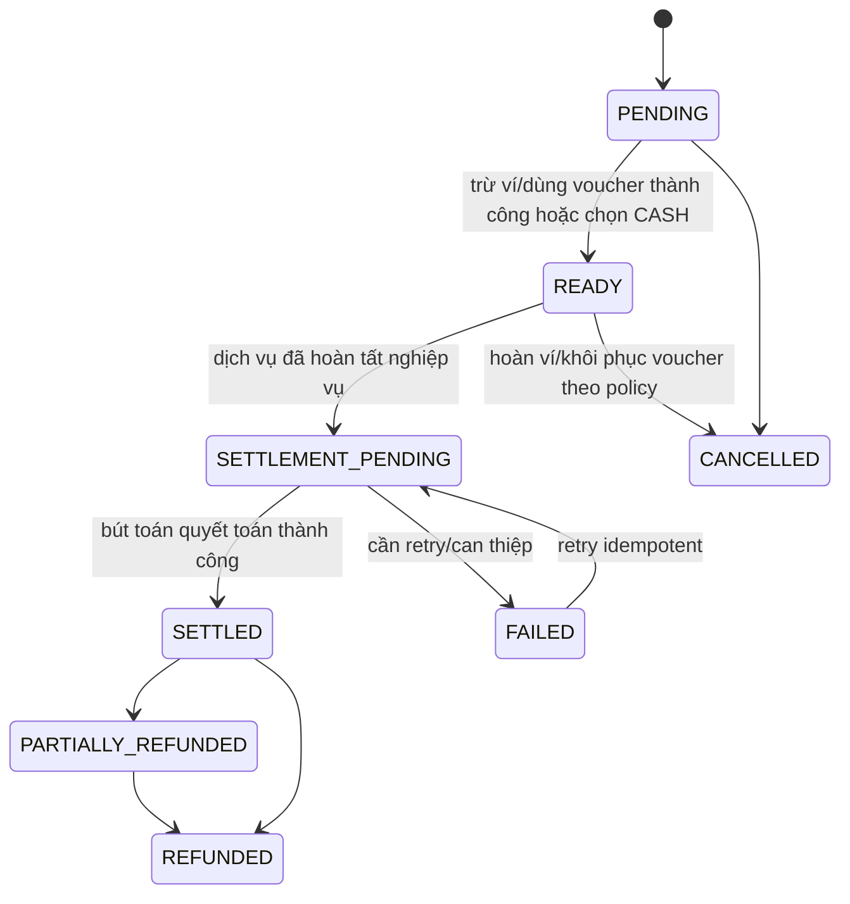

# Flow 09 - Ví lạnh, voucher, tiền mặt và quyết toán

## Mục tiêu

Quản lý ba cơ chế tiền của Delivery và Drive:

1. `VOUCHER`: giảm giá cho khách hàng.
2. `WALLET`: khách thanh toán bằng số dư ví lạnh nội bộ; phần thực trả qua ví cho tài xế được ghi vào ví lạnh nội bộ.
3. `CASH`: khách trả tiền mặt trực tiếp cho tài xế sau khi hoàn tất dịch vụ.

`VOUCHER` là nguồn giảm giá, không phải phương thức thu phần tiền còn lại. Sau khi áp voucher, khách chọn `WALLET` hoặc `CASH` cho `customer_payable`. Nếu voucher giảm 100%, `customer_payable = 0` nhưng hệ thống vẫn giữ payment method đã chọn để có contract nhất quán.

## Thuật ngữ và công thức

“Ví lạnh” trong dự án là tài khoản số dư nội bộ được quản lý bằng ledger, không mang nghĩa ví crypto ngoại tuyến.

Số tiền dùng kiểu `float` theo quyết định sản phẩm. Mọi phép tính phải làm tròn về đơn vị VND tại boundary; đối soát dùng tolerance đã cấu hình thay vì so sánh float bằng phép bằng tuyệt đối.

```text
gross_fare           = tổng giá dịch vụ trước giảm giá
voucher_discount     = phần voucher hợp lệ tài trợ
customer_payable     = max(gross_fare - voucher_discount, 0)
driver_gross_earning = thu nhập gộp tài xế theo chính sách
platform_fee         = driver_gross_earning * (1 - driver_rate)
driver_net_earning   = driver_gross_earning - platform_fee + adjustments
driver_settlement_net = cash_collected + wallet_payment_amount
                      + voucher_payment_amount - platform_fee_debited
                      + settlement_adjustment
```

Baseline v0.2:

- Voucher làm giảm số tiền khách trả nhưng không làm giảm `driver_gross_earning`.
- Phần voucher tài trợ được ghi vào `voucher_payment_amount` trong khoản thanh toán của tài xế sau khi hoàn tất, không tự động cộng vào ví tài xế.
- `platform_fee`/chiết khấu nếu có chỉ được hạch toán khi đơn/chuyến hoàn tất.
- Khi tài xế xem hoặc nhận offer, không trừ tiền, không giữ tiền và không ghi phí vào ví tài xế.
- `driver_rate` do admin cấu hình; giá trị hiện tại là 88%, tương ứng `platform_fee` 12%.

## Mô hình dữ liệu tối thiểu

| Aggregate | Vai trò |
|---|---|
| `Wallet` | Ví của một user, có `currency`, số dư và trạng thái nhận đơn/rút tiền |
| `WalletTransaction` | Bút toán bất biến: nạp, thanh toán, thu nhập, phí, rút tiền, hoàn tiền, điều chỉnh |
| `Voucher` | Mã, thời hạn, điều kiện, ngân sách và giới hạn sử dụng |
| `VoucherRedemption` | Lần dùng/khôi phục lượt voucher của một user cho một order/booking |
| `DiscountTransaction` | Giao dịch giảm giá riêng; liên kết voucher, Payment và order/booking nhưng không liên kết Wallet |
| `Payment` | Snapshot `WALLET/CASH`, quan hệ wallet transaction, breakdown discount và trạng thái quyết toán |
| `Settlement` | Kết quả tính thu nhập gồm `cash_collected`, `wallet_payment_amount`, `voucher_payment_amount`, `platform_fee_debited` và adjustment |

Không sửa trực tiếp số dư. Mọi thay đổi phải tạo `WalletTransaction` cân bằng, có idempotency key, actor, reference và timestamp.

## Trạng thái thanh toán



Trạng thái order/booking và `Payment` độc lập. Nếu giao hàng/chuyến đi đã thực hiện nhưng ghi sổ tạm lỗi, không được xóa hoặc quay ngược bằng chứng dịch vụ.

## Luồng A - Nạp tiền vào ví khách hàng

1. Khách chọn số tiền nạp.
2. Server tạo `TopUpRequest` ở `PENDING` với idempotency key và sinh thông tin chuyển khoản VietQR từ cấu hình hệ thống.
3. Khách quét VietQR và hoàn tất chuyển khoản.
4. SePay gửi webhook giao dịch về hệ thống.
5. Server xác minh webhook, đối chiếu mã/số tiền và chỉ ghi có ví khi giao dịch hợp lệ.
6. Trong transaction, hệ thống tạo bút toán `TOP_UP`, chuyển request sang `COMPLETED` và phát `WALLET_TOPPED_UP`.
7. Webhook lặp được deduplicate theo mã giao dịch SePay và idempotency key; không cộng số dư lần hai.

Top-up là luồng đưa tiền vào hệ thống, không phải phương thức thanh toán trực tiếp của order/booking.

## Luồng B - Trừ tiền và dùng voucher khi khách xác nhận

1. Server đọc quote còn hiệu lực và tính lại điều kiện sử dụng voucher.
2. Nếu có voucher được chọn, tạo `VoucherRedemption` ở `USED` và `DiscountTransaction` ngay khi tạo order/booking.
3. Tính `customer_payable` từ snapshot của quote.
4. Nếu chọn `WALLET`:
   - Khóa ví của payer trong transaction.
   - Kiểm tra `available_balance >= customer_payable`.
   - Tạo bút toán `CUSTOMER_PAYMENT` và trừ ngay `customer_payable`, kể cả đơn/chuyến đặt trước.
5. Nếu chọn `CASH`, chỉ tạo `Payment` ở `READY`; không trừ ví khách.
6. Tạo order/booking ở `SEARCHING_DRIVER` trong cùng transaction logic.
7. Không tạo bất kỳ bút toán nào trên ví tài xế ở bước này hoặc khi tài xế nhận offer.
8. Không cho phép đổi `WALLET/CASH` sau khi order/booking đã được tạo.

## Luồng C - Quyết toán bằng WALLET sau hoàn tất

1. Khi Delivery đạt `DELIVERED` hoặc Drive đã kết thúc, server chốt pricing breakdown cuối cùng.
2. Hệ thống chuyển `Payment` sang `SETTLEMENT_PENDING` bằng command idempotent.
3. Khoản `CUSTOMER_PAYMENT` đã trừ khi tạo đơn/chuyến được đối chiếu với `customer_payable` cuối cùng; không trừ khách lần hai.
4. Hệ thống đọc `DiscountTransaction` đã tạo để ghi `voucher_payment_amount` vào breakdown khoản thanh toán; không tạo wallet transaction cho voucher.
5. Hệ thống tính `platform_fee` và `driver_net_earning` theo `driver_rate` snapshot; tỷ lệ hiện tại là 88%.
6. Phần khách thực trả bằng ví được ghi là `wallet_payment_amount`; hệ thống ghi có phần này và ghi nợ `platform_fee_debited` trên ví tài xế trong cùng settlement. Hiệu ứng ròng ví là `wallet_payment_amount - platform_fee_debited`.
7. `voucher_payment_amount` nằm trong Payment/Settlement và không làm thay đổi số dư ví tài xế.
8. Tất cả bút toán liên quan được commit nguyên tử; `Payment -> SETTLED` và dịch vụ `-> COMPLETED`.

## Luồng D - Quyết toán bằng CASH sau hoàn tất

1. Server chốt `customer_payable` và hiển thị số tiền mặt cần thu cho cả khách lẫn tài xế.
2. Khách trả tiền mặt trực tiếp cho tài xế.
3. Tài xế bấm hoàn thành và xác nhận `cash_collected` trong cùng command idempotent; hệ thống lưu số thực thu, actor và thời điểm thu.
4. Phần voucher từ `DiscountTransaction` được ghi vào `voucher_payment_amount` của settlement, không ghi vào ví.
5. Hệ thống lập breakdown thanh toán tài xế:
   - `cash_collected`: số tiền mặt tài xế đã nhận trực tiếp.
   - `wallet_payment_amount = 0` với đơn tiền mặt.
   - `voucher_payment_amount`: phần voucher tài trợ; chỉ ghi vào khoản thanh toán, không làm tăng số dư ví.
   - `platform_fee_debited`: phí nền tảng bị trừ khỏi ví tài xế sau hoàn tất.
6. Hệ thống kiểm tra `driver_settlement_net = driver_net_earning`; mọi chênh lệch được giữ ở trạng thái cần đối soát, không tự động chuyển vào ví.
7. Ví tài xế có thể âm sau khi trừ phí; khi âm, tài xế bị chặn nhận offer/đơn mới cho đến khi số dư hợp lệ.
8. Khi settlement được ghi nhận thành công, `Payment -> SETTLED` và dịch vụ `-> COMPLETED`.

Tài xế không bị trừ tiền lúc nhận đơn. Với tiền mặt, mọi khoản phí nền tảng chỉ có thể được ghi nhận sau khi đã hoàn tất và có settlement cụ thể.

## Ví dụ quyết toán

Giả sử `gross_fare = 100.000`, `voucher_discount = 20.000`, `driver_rate = 88%`, nên `platform_fee = 12.000` và `driver_net_earning = 88.000`.

| Phương thức | Khách trả | `cash_collected` | `wallet_payment_amount` | `voucher_payment_amount` | `platform_fee_debited` | Settlement ròng |
|---|---:|---:|---:|---:|---:|---:|
| `WALLET` + voucher | Ví khách `80.000` | `0` | `80.000` | `20.000` | `12.000` | `88.000` |
| `CASH` + voucher | Tiền mặt `80.000` | `80.000` | `0` | `20.000` | `12.000` | `88.000` |
| `CASH`, không voucher | Tiền mặt `100.000` | `100.000` | `0` | `0` | `12.000` | `88.000` |

Ở dòng `CASH + voucher`, số dư ví tài xế không tăng từ voucher. `20.000` chỉ xuất hiện trong khoản thanh toán dưới trường `voucher_payment_amount`; ví tài xế giảm `12.000` phí nền tảng sau khi hoàn tất.

Ví dụ không voucher với đơn 18.000 VND và tỷ lệ 88%:

- `WALLET`: ghi nhận `wallet_payment_amount = 18.000` và `platform_fee_debited = 2.160`; hiệu ứng ròng ví tài xế là `+15.840`.
- `CASH`: tài xế nhận trực tiếp `18.000`; sau hoàn tất ví tài xế bị trừ `2.160`, nên thu nhập ròng là `15.840`.

Phí nền tảng luôn là bút toán riêng sau hoàn tất, không thay đổi lịch sử tiền khách đã trả và không bị trừ lúc nhận offer.

## Luồng E - Hủy trước khi hoàn tất

- `WALLET`: tạo bút toán `REFUND/REVERSAL` trả lại đúng khoản đã trừ vào ví payer.
- `CASH`: chưa thu tiền nên không có khoản hoàn.
- `VOUCHER`: redemption đã `USED`; khi hủy hợp lệ, tạo khôi phục lượt theo chính sách và giới hạn hoàn của campaign.
- Phiên bản hiện tại không áp dụng phí hủy hoặc phí chờ tự động.

## COD Delivery

- `cod_amount` là giá trị hàng hóa cần thu hộ, không phải `gross_fare` và không được áp voucher phí vận chuyển.
- COD không được tính vào `driver_gross_earning` hoặc `cash_collected` của phí vận chuyển.
- Tài xế cấu hình hạn mức ứng COD muốn nhận; hệ thống chỉ gửi đơn có `cod_amount` không vượt hạn mức tài xế và hạn mức admin, hiện tối đa 8.000.000 VND.
- Tại điểm lấy, tài xế ứng `cod_amount` cho người gửi; tại điểm giao, tài xế thu lại COD từ người nhận.
- COD ledger theo dõi tiền đã ứng, tiền đã thu lại và ngoại lệ hoàn hàng trên cùng `DeliveryOrder`.
- Refund phí vận chuyển và hoàn tiền COD là hai nghiệp vụ độc lập.

## Luồng F - Rút tiền từ ví tài xế

1. Tài xế nhập số tiền rút và tài khoản ngân hàng đã xác minh.
2. Server kiểm tra ví không âm, số dư khả dụng, mức rút tối thiểu/tối đa và khung giờ do admin cấu hình.
3. Server tạo `WithdrawalRequest` ở `PENDING` và giữ khả năng chi tiêu/rút trùng của số tiền tương ứng.
4. Hệ thống/admin xử lý chuyển khoản thủ công đến tài khoản ngân hàng tài xế đã liên kết.
5. Khi có kết quả tin cậy, server tạo bút toán `WITHDRAWAL` và chuyển request sang `COMPLETED`; khi thất bại, giải phóng số tiền để tài xế có thể yêu cầu lại.
6. Mọi retry dùng cùng idempotency key và không được trừ ví hai lần.

## Luồng G - Hoàn tiền sau quyết toán

1. Nghiệp vụ khiếu nại tạo `RefundRequest` với reason, actor và số tiền tối đa hợp lệ.
2. Hoàn khoản đã trả bằng `WALLET` bằng bút toán ghi có lại ví khách.
3. Hoàn khoản đã trả bằng `CASH` phải ghi rõ bên thực hiện hoàn và bằng chứng xác nhận; không tự cộng ví nếu khách chưa đồng ý nhận hoàn qua ví.
4. Voucher được hoàn lượt hoặc không theo chính sách campaign, với bút toán/redemption đảo riêng.
5. Điều chỉnh thu nhập tài xế chỉ thực hiện sau quyết định có audit; không sửa/xóa settlement ban đầu.
6. Tổng hoàn tiền không vượt tổng tiền khách thực trả, trừ khoản bồi thường được phê duyệt riêng.

## Loại bút toán ví đề xuất

- `TOP_UP`
- `CUSTOMER_PAYMENT`
- `DRIVER_EARNING`
- `PLATFORM_FEE`
- `WITHDRAWAL`, `REFUND`, `REVERSAL`, `MANUAL_ADJUSTMENT`

Mỗi bút toán phải có `wallet_id`, `amount`, `direction`, `currency`, `reference_type`, `reference_id`, `idempotency_key` và `posted_at`.

## Race condition và lỗi

| Tình huống | Xử lý |
|---|---|
| Hai booking cùng trừ một số dư | Khóa/version ví; chỉ transaction còn đủ số dư được commit |
| Voucher dùng đồng thời | Unique redemption/rule usage trong transaction; chỉ một `DiscountTransaction` được commit |
| SePay webhook lặp | Deduplicate theo mã giao dịch SePay và idempotency key |
| Settlement job lặp | Trả settlement cũ; không ghi nợ/ghi có lần hai |
| Ghi sổ thất bại sau dịch vụ | Giữ `SETTLEMENT_PENDING/FAILED`, retry toàn bộ transaction idempotent |
| Khách không trả đủ tiền mặt | Lưu `cash_collected` thực tế, tạo incident/ticket; không đánh dấu `SETTLED` giả |
| Final fare lớn hơn số tiền khách đã trả | Không thu thêm khách; tạo adjustment trên settlement/ví tài xế theo rule cấu hình |
| Ví tài xế âm sau settlement | Hoàn tất settlement nhưng chặn nhận đơn mới cho đến khi số dư hợp lệ |

## Sự kiện

- `WALLET_TOP_UP_REQUESTED`, `WALLET_TOPPED_UP`
- `CUSTOMER_WALLET_DEBITED`, `CUSTOMER_WALLET_REFUNDED`
- `VOUCHER_USED`, `VOUCHER_USAGE_RESTORED`
- `CASH_COLLECTION_CONFIRMED`
- `DRIVER_EARNING_SETTLED`
- `DRIVER_WITHDRAWAL_REQUESTED`, `DRIVER_WITHDRAWAL_COMPLETED`, `DRIVER_WITHDRAWAL_FAILED`
- `PAYMENT_SETTLED`, `PAYMENT_SETTLEMENT_FAILED`
- `REFUND_COMPLETED`

## Tiêu chí nghiệm thu

- Ví khách không được âm; chỉ cần ví tài xế nhỏ hơn 0 thì bị chặn nhận đơn mới, không áp dụng giới hạn nợ âm khác.
- Cùng một top-up, customer payment, settlement, withdrawal hoặc refund không được ghi sổ hai lần.
- Voucher chỉ được dùng đúng điều kiện, được đánh dấu `USED` ngay khi tạo order/booking và chỉ được khôi phục qua policy hủy hợp lệ.
- Nhận offer không thay đổi số dư hoặc phát sinh chiết khấu cho tài xế.
- Tài xế chỉ được lập khoản thanh toán sau khi Delivery/Drive hoàn tất.
- Sau làm tròn VND, `cash_collected + wallet_payment_amount + voucher_payment_amount - platform_fee_debited + settlement_adjustment` phải khớp `driver_net_earning` trong tolerance cấu hình.
- Voucher giảm tiền khách phải trả nhưng không làm giảm thu nhập gộp tài xế; `voucher_payment_amount` không được ghi có vào ví.
- Có thể dựng lại số dư ví từ ledger và toàn bộ breakdown thanh toán từ settlement mà không dựa vào log ứng dụng.
