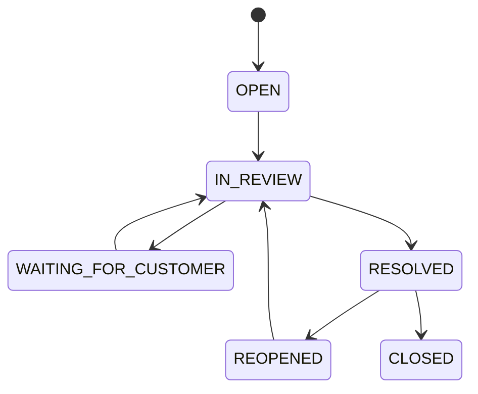

# Flow 11 - Đánh giá và khiếu nại

## Mục tiêu

Thu nhận phản hồi sau dịch vụ, hỗ trợ giải quyết tranh chấp và tạo audit đầy đủ cho mọi điều chỉnh tiền/trạng thái.

## Luồng A - Đánh giá

1. Khi order/booking `COMPLETED`, hệ thống mở cửa sổ đánh giá có thời hạn.
2. Khách đánh giá tài xế theo thang điểm cấu hình, tag lý do và nhận xét tùy chọn.
3. Tài xế có thể đánh giá trải nghiệm với khách theo chính sách.
4. Server kiểm tra actor thuộc dịch vụ, chưa đánh giá cùng chiều và còn thời hạn.
5. Rating được lưu; dữ liệu tổng hợp cập nhật bất đồng bộ để tránh chặn response.
6. Nội dung vi phạm được ẩn/chuyển moderation; điểm thấp có thể tạo case theo rule.

## Quy tắc rating

- Một actor chỉ đánh giá một lần cho mỗi order/booking; cho phép sửa trong khoảng ngắn nếu sản phẩm chốt.
- Không cho đánh giá đơn/chuyến chưa hoàn tất hoặc không liên quan.
- Không công khai số điện thoại, địa chỉ chi tiết hoặc dữ liệu nhạy cảm trong nhận xét.
- Điểm tổng hợp cần ngưỡng mẫu tối thiểu và chống thao túng.
- Rating không tự động quyết định đình chỉ nếu chưa qua rule/rà soát phù hợp.

## Luồng B - Tạo khiếu nại

1. Khách/tài xế chọn order/booking và nhóm vấn đề: giá, thanh toán, thái độ, đồ thất lạc, hư hỏng, an toàn hoặc khác.
2. Client hiển thị form/evidence phù hợp với nhóm vấn đề.
3. Server tạo `SupportTicket` với priority, SLA, actor, liên kết dịch vụ và snapshot liên quan.
4. Ticket an toàn/đồ thất lạc được route vào hàng đợi chuyên biệt.
5. Người dùng nhận mã ticket và theo dõi trạng thái.

## Trạng thái ticket

## Luồng C - Xử lý của admin/support

1. Nhân viên nhận ticket theo quyền và hàng đợi.
2. Hệ thống hiển thị timeline trạng thái, payment/settlement, wallet ledger, assignment, vị trí cần thiết và evidence.
3. Nhân viên yêu cầu bổ sung hoặc đưa ra kết quả bằng reason code chuẩn.
4. Nếu điều chỉnh tiền, tạo `REFUND`, `REVERSAL` hoặc `MANUAL_ADJUSTMENT` qua wallet ledger/settlement; không sửa trực tiếp bút toán gốc.
5. Nếu xử lý tài khoản, tạo warning/suspension riêng với thời hạn và lý do.
6. Người dùng nhận kết quả và thời hạn phản hồi; ticket được đóng sau quy trình.

## Phân quyền MVP

Không cam kết SLA bằng số trong phạm vi đồ án. Ticket được xử lý theo priority và thứ tự hàng đợi.

| Vai trò | Quyền chính |
|---|---|
| `SUPPORT` | Xem ticket được phân công, dữ liệu đơn/chuyến liên quan, trao đổi với người dùng, yêu cầu evidence và đề xuất kết quả |
| `ADMIN` | Toàn bộ quyền support; duyệt tài xế, quản lý cấu hình, khóa tài khoản, phê duyệt điều chỉnh ví/rút tiền và phân công ticket |

Support không được sửa trực tiếp wallet ledger, trạng thái tài khoản hoặc cấu hình hệ thống. Mọi truy cập dữ liệu nhạy cảm và thao tác admin đều phải audit.

## Bảo mật và lưu trữ

- Evidence dùng signed URL và phân quyền theo ticket.
- Mọi lần admin xem dữ liệu nhạy cảm phải có audit.
- Không lưu lịch sử hành trình; support chỉ xem snapshot vị trí cuối cùng nếu cần và có quyền. Retention cho chat, giấy tờ/evidence áp dụng theo cấu hình triển khai.
- Dữ liệu dùng cho tranh chấp phải được legal hold khi chính sách yêu cầu.

## Sự kiện

- `RATING_SUBMITTED`
- `LOW_RATING_FLAGGED`
- `SUPPORT_TICKET_CREATED`
- `SUPPORT_TICKET_UPDATED`
- `SUPPORT_TICKET_RESOLVED`
- `FINANCIAL_ADJUSTMENT_REQUESTED`

## Tiêu chí nghiệm thu

- Không thể đánh giá dịch vụ không thuộc user hoặc chưa hoàn tất.
- Submit lặp không tạo nhiều rating/ticket ngoài ý muốn.
- Mọi điều chỉnh tiền đi qua wallet ledger/settlement và có reason/actor.
- Tài liệu nhạy cảm không lộ qua URL công khai hoặc notification payload.
