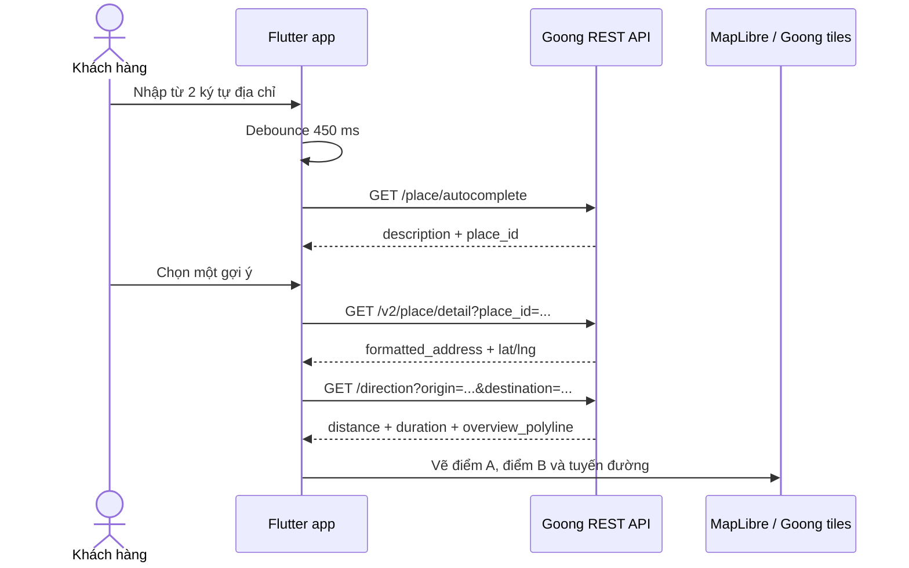

# Luồng nghiệp vụ khách hàng

## 1. Mở ứng dụng và xác thực

1. App khôi phục token từ secure storage.
2. App yêu cầu quyền vị trí `while in use`. Nếu người dùng từ chối, các chức năng tài khoản vẫn dùng được; nút dùng vị trí hiện tại sẽ báo lỗi rõ ràng.
3. Nếu token còn hiệu lực, app tải catalog phương tiện, lịch sử và yêu cầu đang chạy.
4. Nếu chưa đăng nhập, khách hàng đăng ký hoặc đăng nhập bằng số điện thoại. Đăng ký mới phải xác minh OTP trước khi tạo dịch vụ.

## 2. Chọn dịch vụ

Từ trang chủ, khách hàng chọn một trong các nhánh:

- `DELIVERY`: giao hàng, cần loại hàng và khối lượng.
- `DRIVE`: đặt xe, cần số hành khách.
- Đặt lịch: dùng luồng `DRIVE` nhưng thêm `scheduled_at`, tối đa 30 ngày.

Sau đó khách hàng chọn loại phương tiện do backend trả về. Mobile không tự tính giá hoặc tự suy luận loại xe.

## 3. Chọn địa chỉ và tuyến đường



Quy tắc dữ liệu:

- Không cho người dùng nhập latitude/longitude trực tiếp.
- Autocomplete chỉ gọi sau khi có ít nhất 2 ký tự và đã ngừng nhập 450 ms để hạn chế chi phí API.
- Chọn suggestion dùng Place Detail để lấy tọa độ chuẩn.
- Nhấn tìm kiếm trên bàn phím dùng Geocode làm fallback cho địa chỉ đầy đủ.
- Điểm đón có thể lấy từ GPS; địa chỉ hiển thị là `Vị trí hiện tại` và tọa độ thật được gửi trong quote.
- Directions dùng `bike` cho giao hàng và `car` cho đặt xe.

## 4. Báo giá và tạo yêu cầu

App gửi payload báo giá cho backend gồm dịch vụ, phương tiện, điểm đón, điểm đến, thông tin hàng/chuyến, voucher và lịch. Backend là nguồn sự thật cho quãng đường tính cước, giá, voucher và thời hạn quote; dữ liệu Directions trên mobile chỉ dùng để preview.

```text
Chọn địa chỉ -> Preview tuyến -> Nhận báo giá -> Chọn thanh toán
-> Xác nhận -> Tìm tài xế -> Theo dõi -> Hoàn tất -> Đánh giá
```

Quote hết hạn hoặc payload không hợp lệ phải quay lại bước báo giá. Nút tạo yêu cầu dùng idempotency key để thao tác retry không tạo hai đơn.

## 5. Theo dõi và kết thúc

- Sau khi tạo yêu cầu, app lưu `service_request_id` gần nhất vào secure storage.
- Socket thông báo thay đổi; polling 10 giây tải snapshot chuẩn từ backend.
- Khách hàng có thể chat, tạo ticket hỗ trợ, báo SOS hoặc hủy khi trạng thái cho phép.
- Khi hoàn tất, app mở đánh giá sao và nhận xét. Trạng thái cuối gồm `COMPLETED`, `CANCELLED`, `DELIVERY_FAILED`, `RETURNED`.

## 6. Trạng thái lỗi cần hiển thị

| Tình huống | Hành vi UI |
|---|---|
| Từ chối GPS | Giữ app hoạt động, báo lý do và cho nhập địa chỉ |
| Thiếu Goong REST key | Không gọi API, hiển thị hướng dẫn cấu hình |
| Thiếu Goong map key | Không tạo native map, hiển thị placeholder |
| Autocomplete lỗi | Giữ nội dung ô nhập và cho thử lại |
| Place Detail không có tọa độ | Không thay vị trí đã chọn |
| Directions lỗi | Vẫn cho backend báo giá bằng hai tọa độ đã chọn |
| Backend từ chối quote | Hiển thị lỗi tại cuối form, không sang checkout |

## 7. Bảo mật và vận hành

- Không commit Goong key. Truyền key bằng `--dart-define` trong môi trường build.
- Giới hạn key theo ứng dụng/quota trong Goong console. REST key nằm trong binary mobile vẫn có thể bị trích xuất; production nên proxy các REST call qua backend nếu cần giữ bí mật tuyệt đối.
- Theo dõi tỷ lệ lỗi Autocomplete/Place Detail/Directions riêng với lỗi quote backend.
- Không log API key, token đăng nhập hoặc toàn bộ payload có thông tin vị trí của người dùng.
